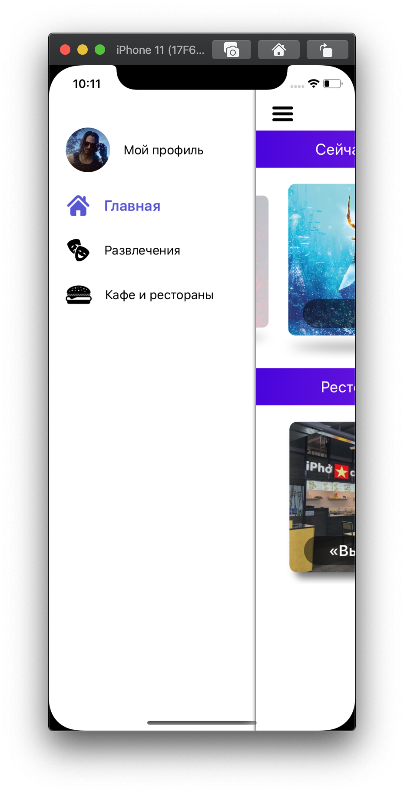
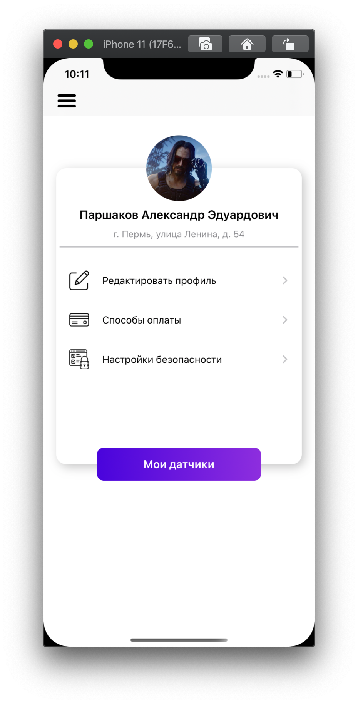
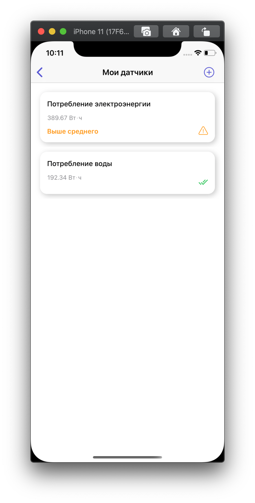

# YourSmartCity
A studying project for an app that shows different categories of a smart city. 

** Kinds of data provided are limited due to research demonstration sufficiency.

## Employed libraries
* SwiftEntryKit
* Hero
* Lottie-ios
* SWRevealViewController
* Alamofire
* SnapKit

## Launching the app and checking out movie information
* On launch, the app requests data from the server, signalling of loading with the loader. 
* As the data arrives, the space expands, and thumbnails of movies reveal in an appealing manner.

## Menu and Profile
* User can switch to a different category of Smart City (to be implemented).
* User can see information of his profile and sensors accounted for him.
 

Slide-out menu             |  Profile |  Sensors 
:-------------------------:|:-------------------------:|:-------------------------:
   |    |   

## Scanning a QR-code to explore a building
* When the user finds the QR-code of interest (presumably placed on a building wall), it is possible to scan the code and learn some further information.
* Scanning a valid code thereafter shows a building thumbnail and asks the user if s/he would like to explore information about the building.
* Scanning an invalid QR-code leads to a corresponding message.
 
